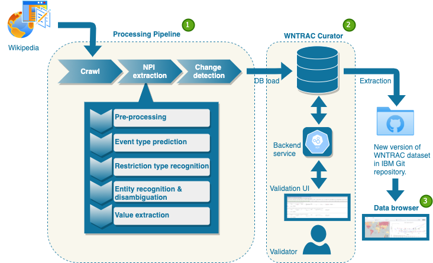

# WNTRAC Automated NPI Curation System

The architecture of the system is described in our upcoming [paper](https://arxiv.org/abs/2009.07057). The system, shown in the figure below, is designed to be scalable for continuous gathering, extraction and validation of NPI events. It consists of two subsystems: a data processing pipeline for capturing and extracting potential NPI events from Wikipedia articles and a tool called WNTRAC Curator for human validation of NPI events automatically extracted using the aforementioned pipeline. The repository also contains source for the an interactive [data browser](https://covidresponse.res.ibm.com) that provides end users with the ability to engage with the dataset & view associations between NPIs and outcomes across regions, within specific countries/territories, and comparing with neighboring regions.

Please follow the links below to build and launch the three components.
1. [Processing Pipeline](pipeline/)
2. [WNTRAC Curator](curator/)
3. [Data browser](databrowser/)